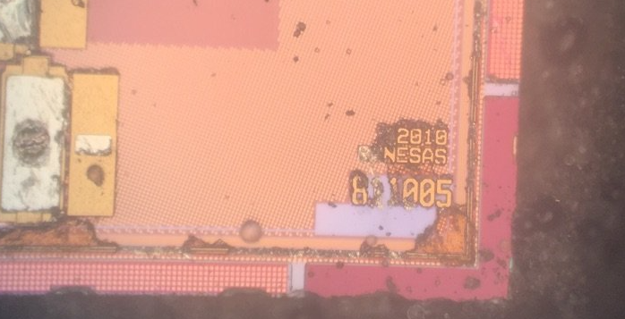
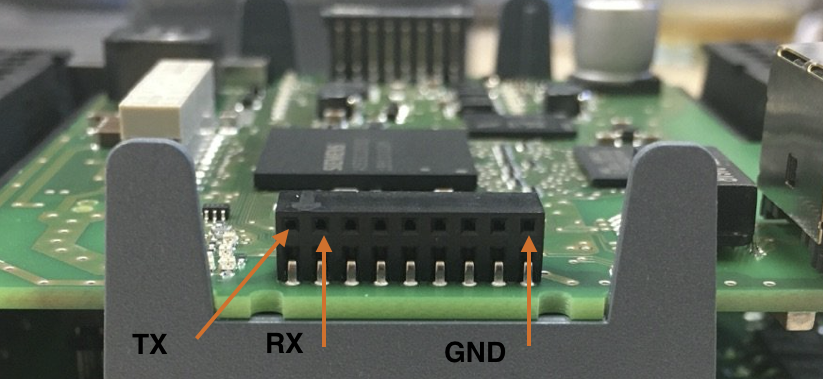

<p align="center">
  
</p>


# Siemens S7 PLCs Bootloader Arbitrary Code Execution Utility

This repository describes the way we get non-invasive arbitrary code execution on the Siemens S7 PLC by using an undocumented bootloader protocol over UART. Siemens assigned SSA-686531 (CVE-2019-13945) for this vulnerability. Affected devices are Siemens S7-1200 (all variants including SIPLUS) and S7-200 Smart. The list of the content are as follows:


## Target Device Overview

In this section we will provide quick overview about the device. 


### Hardware
We used an S71200, CPU 1212C DC/DC/DC [6ES7 212-1AE40-0XB0](https://mall.industry.siemens.com/mall/en/WW/Catalog/Product/6ES7212-1AE40-0XB0) for our research.
The SoC in the our device was an A5E30235063 relabelled as Siemens SoC. However, the SoC decapsulation reveals that the SoC is based on Renesas 811005 (model 2010) as illustrated in the figure below:



### Instruction Set
The exact version of the ARM instruction set running on the PLC was queried using the following ARM instruction:
```asm
mrc p15, 0, r0, c0, c0, 0
```
We got a response with value 0x411fc143 (0b1000001000111111100000101000011), meaning that it is a ARM Cortex R4 Revision 3, ARMv7 R, Thumb 2 Real-Time profile SoC with Protected Memory System Architecture (PMSA), based on a Memory Protection Unit (MPU). 

### NAND Flash Spec
The S7-1200 DC/DC/DC v2018 is using Micron Technologies NQ281 (FBGA code) 1Gbit (128MB) flash. Using Micron FBGA decoder we could get the part number of the flash. The part number is MT29F1G16ABBDAHC-IT:D. Note that in mid 2019, Siemens updated the NAND Flash to NW812 (MT29F1G08ABBFAH4-ITE:F).

### RAM
Siemens S7-1212C v4 is using a 1GB Winbond W94AD2KB or 256MB W948D2FBJX6E high-speed LPDDR1 SDRAM or a Micron Technologies MT46H32M32LFB5-5 IT (FBGA code D9LRB) in a 90-Ball VFBGA form. The RAM is running at 100Mhz. 


## Bootloader UART Protocol Overview

An interesting observation we made when looking at the firmware more deeply to investigate non-invasive access techniques is a protocol over UART during the very early boot stage implemented by the bootloader (v4.2.1). During startup, the bootloader waits for half a second, listening on the serial input to receive a magic sequence of bytes. Upon receiving those bytes in the given timeframe the bootloader enters a special protocol offering a large variety of functionality over serial. A client for the UART protocol containing functionality to execute payloads on the PLC from within early boot is implemented in [this utility](client.py).


### Initial Handshake

In the bootloader at address `0x0368` is called to wait for a magic string "MFGT1" within half a second. If such a string is encountered, it will answer with the string "-CPU" and return 1 to indicate that the protocol handler is getting executed. The return value of this function is checked at `0x0EDF0` and the protocol handler at `0xF3D0` is entered if the initial handshake has been performed.


### Handler Types
The UART protocol handler exposes a list of low level functions. There are multiple layers of handlers present in the system:
1. Primary Handlers: A primary list of handlers that can be invoked directly from the first protocol stage. They are stored in a table inside the bootloader starting at address `0x014D98` with 128 entries.
2. Additional Hooks: The first stage handler residing at address `0x00011180` with the assigned handler index `0x1c` allows calling hooks from a second list starting at `0x00015280`. 
3. Subprotocol: A Primary Handler 0x80 at `0x0000D1F0` (handler index `0x80`) enters an additional menu loop exposing what seems to be a setup/read/write triple of operations for different kinds of devices/components in the system such as flash, IRAM and an unknown device type.


### Packet/Message Format
Whenever contents are sent by one party, the following structure is expected by the protocol:
```
<length_byte><contents><checksum_byte>
```
The length is a single byte value field describing the length of `contents`+1. The checksum is a byte that completes the sum of all input bytes (including the length byte) to `0 mod 0x100`.


### Handler Type Implementations

#### 1. Primary Handler
The Primary Handler function is located at `0x0000EE48`. Commands are accepted in the form of single packets/messages as described above. After a correctly checksum packet is received, the first byte of the packet is interpreted as the command number.

For command number `0x80`, the Subprotocol handler is invoked in a mode based on the next two bytes of the incoming message (`0x3BC2`: mode 1, `0x9D26`: mode 2, `0xE17A`: mode 3, `0xC54F`: mode 4).
Command number `0xA2` represents the exit command. Command `0xA0` allows some configuration of the UART protocol. The semantics are not yet exactly determined.

For command numbers lower or equal `0xB0`, the respective Primary Hook inside the handler table starting at `0x00014D98` is invoked.


#### 2. Additional Hooks
A second layer of handlers is accessible via the first stage handler residing at address `0x00011180` with the assigned handler index `0x1c`. It relays invocations to a second layer of functions based on the arguments provided inside the packets sent by the other side of the protocol. The list of this secondary handler is initially stored in a table starting at `0x00015280` inside the bootloader. Before actual usage the table is then copied over to `0x1003ABA0` and then the copy in RAM is accessed rather than contents in the bootloader. This is important as overriding the actually used function pointers does not involve modifying bootloader memory (which may expected to be read-only and may trigger detection mechanisms and failing checksum tests).

The table containing the additional hooks has 33 entries. The index of this hook is checked against the boundaries `0<=index<=32`. Also, each table entry contains information about the length of the input expected by the particular additional hook:
- `0`: The handler is disabled
- `1-0xfe`: The input length has to match the given value exactly
- `0xff`: Variable input length


A list of the Additional hooks can be retrieved from the list inside the bootloader starting at `0x15280` . The reversing maturity of those handlers is not very advanced so a list is not generated here. Looking at the actual functions should be the best option to understand the range of functionality should the need arise. By default most handlers are disabled from being executed directly.


##### Subprotocol (Primary Handler `0x80`) Details
This handler seems to be responsible for performing updates of different components over UART. To enter this protocol in one of four modes, handler `0x80` has to be invoked with a 2-byte argument describing the mode used by the sub handler. Every mode corresponds to one component to be updated:

| Mode Number | Component |
| ----------- | --------- |
| 1 | Hardware device mapped to memory around region `0x10000000`. This seems to match IRAM memory |
| 2 | SPI1 / IOC mappings are used here, exact component so far unknown |
| 3 | Firmware flash memory |
| 4 | NOP |

For each component, three to four types of functions are supported. The rough semantics are: Preparation/Setup, (Metadata) Read, (Update) Write, Cleanup.

When the subprotocol handler is entered, another loop handling commands sent via UART is performed. At least one argument byte is expected from here which - together with the overall input length - acts as a switch for the function to be used.

The handler that is the most important for getting code execution is handler number 1 (writes internal memory such as ITCM and IRAM).
A way to update flash contents is sub-handler number 3. 


## Non-Invasive Arbitrary Code Execution
Using a combination of the functionality provided above we were able to gain arbitrary code execution on the device using the UART protocol. The client implementing this is located at [client.py](client.py).

The idea behind the implementation is as follows:
- Use the subprotocol handler's memory RAM update component to inject a custom shellcode payload to IRAM. This is implemented as the first step in the function `_exploit_install_add_hook` in [client.py](client.py)
- Use the subprotocol handler's memory RAM update component to create a function pointer to the custom shellcode above by injecting an additional hook address into the additional hook table in IRAM at `0x1003ABA0`. This is implemented as the second step in the function `_exploit_install_add_hook` in [client.py](client.py)
- Use the handler `0x1c` to call the custom shellcode. This is implemented in the function `invoke_add_hook` in [client.py](client.py)


#### RCE in older PLCs
We spotted similar functionality in 2014 models of S7-1212C Siemens PLCs (6ES7212-1BE31-0XB0). The bootloader functionality was spotted at offset 0xE664 of older PLC bootloader (S7-1200v3).


### Setup Environment

As mentioned earlier we used a 6ES7 212-1AE40-0XB0 S7-1200 PLC with a ALLNET ALL3075V3 Network controlled socket and a FTDI FT232RL USB to TTL Serial Converter. 


#### UART Wiring
To be able to utilize this utility you need to connect to a UART interface of the PLC. For the pins on the side of the PLC (next to the RUN/STOP LEDs), populate the top row like the following: 

.


One can use any TTL 3.3V device. Obviously you should connect TX pin of the TTL adapter to the RX port of the PLC and RX port of the TTL adapter to the TX port of the PLC. 


## Using our tool
We are still completing this section. 